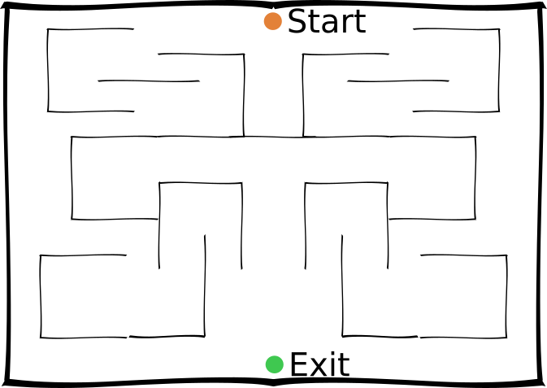

## Abstraction

Why do we care about abstraction?

Following from [Near Optimal Behavior via Approximate State Abstraction](https://arxiv.org/abs/1701.04113), I am interested in using their to reason about which policies are representable under an abstraction with certain peroperties.

$$
\phi (\cdot) = \phi(\cdot) \implies \forall_\cdot \mid f(\cdot) - f(\cdot)\mid \le \epsilon\\
$$

What does the above say? _We want our abstraction to contain approximate symmetries $\forall x \mid f(x) - f(T(x)) \mid \approx 0$_.

What can we pick as $f$?

1. $\mid Q(\cdot) - Q(\cdot)\mid \le \epsilon$.
2. $\sum_{\cdot \in N} \mid \tau(\cdot) - \tau(\cdot)\mid \le \epsilon$ AND $\mid r(\cdot) - r(\cdot) \mid \le \epsilon$. The transition and reward) functions are approximately the same.
3. ???

Note: two states having similar f are not guaranteed to have similar abstraction!

Given an abstraction of the form above, we want to find an abstraction that allows us to find a policy in the abstracted MDP that achieves bounded error wrt the original MDP. We want to find a tight $\eta_f$ s.t.

$$
\forall_{s\in S_G, a\in A_G} \mid Q_G^{\pi^* }(s, a) - Q_G^{\pi_{GA}^* }(s, a) \mid \le 2 \epsilon \eta_f
$$

Aka, within the abstracted space, we can approximately represent the optimal policy.

> __Claim 1:__ 1. will yield the most compression, while performing well. But, it is a task specific representation, thus it will not transfer / generalise well.

#### Extension to other types of abstraction

State abstraction groups together states that are similar.
For example, sprinting 100m is equivalent regardless of which track lane you are in.

Action abstraction groups together actions that are similar.
For example, X and Y both yeild the state change in state,

$$
\begin{align}
\phi (s_1) = \phi(s_2) &\implies \forall_a \mid Q(s_1, a) - Q(s_2, a)\mid \le \epsilon \tag{State abstraction} \\
\phi (a_1) = \phi(a_2) &\implies \forall_s \mid Q(s, a_1) - Q(s, a_2)\mid \le \epsilon \tag{Action abstraction} \\
\phi (s_1, a_1) = \phi(s_2, a_2) &\implies \mid Q(s_1, a_1) - Q(s_2, a_2)\mid \le \epsilon \tag{State-action abstraction} \\
\end{align}
$$

> __Claim 2:__ The state-action abstraction is the most powerful because it allows the compression of the most symmetries. (want to prove!)

### Motivating example: Symmetric maze

Imagine you are in a mirror symmetric maze. It should not matter to you which side of mirror you are on.

<!--  -->

This reduces the state-action space by half! $\frac{1}{2}\mid S \mid \times \mid A \mid$. Note: just using state abstraction it is not possible to achieve this reduction. Mirrored states are not equivalent as the actions are inverted.

## Generalised symmetries

What about other types of symmetry, other than mirror?

- $\exists f\in X: \forall_{s, a} r(s, a) = r(f(s), a)$. Where $X=GL_N \lor S_N \lor \dots$

### Notes

Struggling with the direction of implication, $\phi (s_1) = \phi(s_2) \implies \forall_a \mid Q(s_1, a) - Q(s_2, a)\mid \le \epsilon$, what about $\phi (s_1) = \phi(s_2) \impliedby \forall_a \mid Q(s_1, a) - Q(s_2, a)\mid \le \epsilon$?

But can we guarantee that these abstractions do not make it harder to find the optimal policy? Is that even possible?

So this is about messing with what information the value function has. Given more information about the future, we should expect the acuracy (or speed of learning) of the estimate to go up!?
