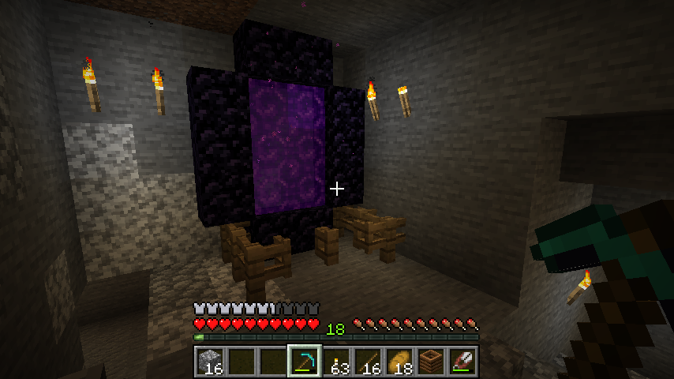

## What is RL?

Reinforcement learning is a (sub)set of solutions to the collection of 'optimal control problems' that look like;

$$
V(\pi) = \mathop{\mathbb E} [\sum_{t=0}^{\infty} \gamma^t r(s_t, a_t) ]
$$

$$
\pi^{* } = \mathop{\text{argmax}}_{\pi} V(\pi)
$$

## Alternative formualation

$$
\begin{aligned}
V(\pi^{* }) \equiv  \mathop{\mathbb E}_{s_0\sim d_0} \mathop{\text{max}}_{a_0} r(s_0, a_0)
+ \gamma  \mathop{\mathbb E}_{s_1\sim p(\cdot | s_0, a_0)} \Bigg[ \\ \mathop{\text{max}}_{a_1} r(s_1, a_1)
+ \gamma \mathop{\mathbb E}_{s_2\sim p(\cdot | s_1, a_1)} \bigg[ \\ \mathop{\text{max}}_{a_2} r(s_2, a_2)
+ \gamma  \mathop{\mathbb E}_{s_3\sim p(\cdot | s_2, a_2)} \Big[
\dots \Big] \bigg] \Bigg]
\end{aligned}
$$

## Why are RL problems hard?

Because of three main properties;

1. they allow, __evaluations__, but dont give 'feedback',
2. the observations are sampled __non-IID__,
3. they provide __delayed__ credit assignment.

## Example: Multi-armed Bandits

The two armed bandit is one of the simplest problems in RL.

- Arm 1: [10, -100, 0, 0, 30]
- Arm 2: [2, 0]

Which arm should you pick next?

## Why do exploration strategies matter?

Why not just do random search?

insert pic

- Too much exploration and you will take many sub optimal actions, despite knowing better.
- Too little exploration and you will take 'optimal' actions, at least you think they are optimal...

## An example: MineRL!

http://minerl.io/competition/
Goal: Find and mine a diamond.

- iron is useful for making tools.
- coal and a furnace is probably needed to make iron.
- we can guess which of these is likely to be diamond
- we know that diamonds are likely to be found (deep) underground
- we

> Last time I tried to mine the blue sparkly rocks, nothing happened, This time, 1,000 actions later, I got diamonds. Which action(s) helped?

(we have an understanding of tools, and that they are the reason we got diamonds this time. This allows us to assign credit to the act of forging and mining with an iron pick-axe.)

## What do we require from an exploration strategy?

- Non-zero probability of reaching all states, and trying all actions in each state.
- Converges to a uniform distribution over states. (?)
- ?

Nice to have

- Scales sub-linearly with states
- Samples states according to their variance. More variance, more samples.
- ?

## What are some existing exploration strategies?

- Injecting noise: [Epsilon greedy](), [boltzman]()
- Optimism in the face of uncertainty
- Bayesian model uncertainty and [Thompson sampling]()
- [Counts](https://arxiv.org/abs/1703.01310) / densities and [Max entropy](https://arxiv.org/abs/1812.02690)
- Intrinsic motivation ([Surprise](https://arxiv.org/abs/1808.04355), [Reachability](https://arxiv.org/abs/1810.02274), Randomly picking goals)
- [Disagreement](https://arxiv.org/abs/1906.04161)

Note. They mostly require some form of memory and / or a model of uncertainty.
Exploration without memory is just random search...

## Counts / densities

In the simplest setting, we can just count how many times we have been in a state.
We can use this to explore states that have have low visitation counts.

$$
\begin{aligned}
P(s=s_t) = \frac{\sum_{s=s_t} 1 }{\sum_{s\in S}1} \\
a_t = \mathop{\text{argmin}}_{a} P(s=\tau(s_t, a)) \\
\end{aligned}
$$

## Intrisnic motivation

'Surprise'

$$
r_t = \parallel s_{t+1} - f_{dec}(f_{enc}(s_t, a_t)) \parallel_2^2
$$

'Reachability'

$$
r_t = \mathop{\text{min}}_{x \in M} D_k(s_t, x)
$$

## Maximum entropy

$$
\begin{aligned}
P^{\pi}(\tau | \pi) = d_0(s_0) \Pi_{t=0}^{\infty} \pi(a_t | s_t)P(s_{t+1} | s_t, a_t) \\
d^{\pi}(s, t) = \sum_{\text{all $\tau$ with $s = s_t$}}P^{\pi}(\tau | \pi) \\
d^{\pi}(s) = (1-\gamma)\sum_{t=0}^{\infty} \gamma^t d^{\pi}(s, t) \\
\pi^{* } = \mathop{\text{argmax}}_{\pi} \mathop{\mathbb E}_{s \sim d^{\pi}} [ \log d^{\pi}(s)] \\
\end{aligned}
$$

## What is an inductive bias?

Underconstrained problems.

## Example: Matrix factorisation

Lowest rank solution

- wug test?

## Inductive biases in exploration strategies

So my questions are;

- do some of these exploration strategies prefer to explore certain states first?
- which inductive biases do we want in exploration strageties?
- how can we design an inductive biases to accelerate learning?
- what is the optimal set of inductive biases for certain classes of RL problem?
- how quickly does the state visitation distribution converge?

## Examples

Surprise
- A bias towards states with more noise in them.

Density
- The approximation of the density may be biased

Intrinsic motivation
-

## Minecraft

Crafting is super imporant. But has a combinatorial nature.
We bring many priors to help us. We know that;

{width=200}
{width=200}

{width=200}

## A principled approach.

> How can we reason about inductive biases in exploration strategies in principled manner?

Convergence
$$
KL(d^{\pi}(s, t), d^{\pi}(s))
$$

## {.standout}

Thank you!

And questions?
