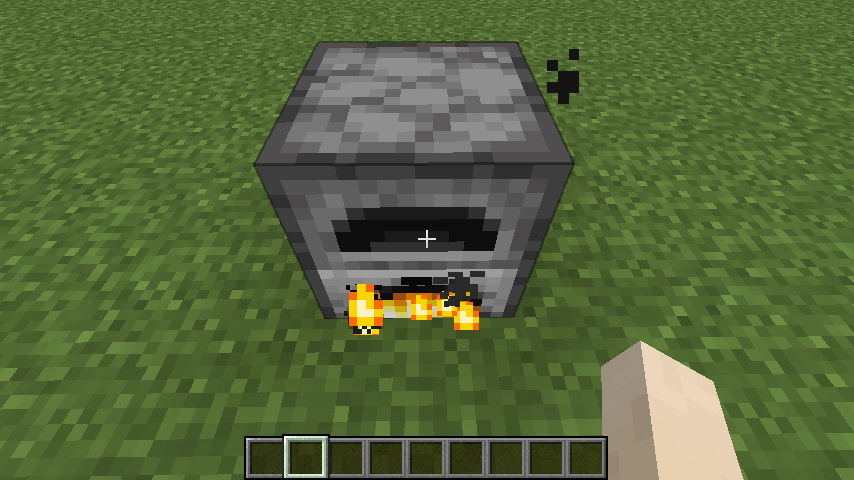
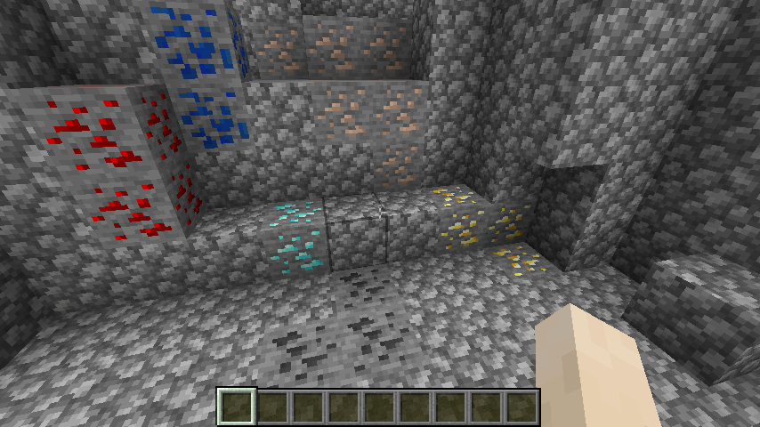
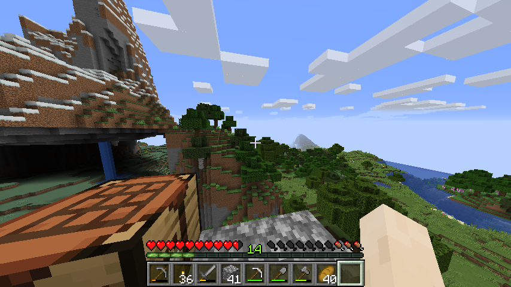
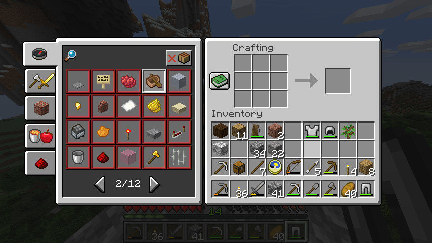

## What is RL?

> (learning to) make optimal decisions

__Markov decision problems__

\begin{align*}
M = \{S, A, \tau, r, d_0\} \tag{the MDP}\\
\tau: S \times A \to \Delta(S) \tag{the transition fn}\\
r: S \times A \to \mathbb R^+ \tag{the reward fn}\\
\end{align*}

## MDPs

\begin{align*}
\pi: &S \to \Delta(A)  \tag{the policy}\\
s_{t+1} &\sim \tau(\cdot| s_t, a_t), a_t \sim \pi(\cdot| s_t) \tag{sampled actions and states} \\
V(\pi) &= \mathop{\mathbb E}_{D(\pi)} [ \gamma^0 r(s_0, a_0) + \gamma^1 r(s_1, a_1) + \dots + \gamma^t r(s_t, a_t)] \tag{value estimate} \\
\pi^{* } &= \mathop{\text{argmax}}_{\pi} V(\pi) \tag{the optimisation problem}
\end{align*}

## Why are RL problems hard?

Because of three main properties;

1. they allow, __evaluations__, but dont give 'feedback',
2. the observations are sampled __non-IID__,
3. they provide __delayed__ credit assignment.

## Example: Multi-armed Bandits

The two armed bandit is one of the simplest problems in RL.

- Arm 1: $[10, -100, 0, 0, 30]$
- Arm 2: $[2, 0]$

Which arm should you pick next?

<!-- Try to get them to answer! -->
Why not just do random search?

## An example: MineRL

Goal: Find and mine a diamond.

{width=400}

## What are some existing exploration strategies?

- Injecting noise: [Epsilon greedy](), [Boltzman]()
- Optimism in the face of uncertainty
- [Counts](https://arxiv.org/abs/1703.01310) / densities and [Max entropy](https://arxiv.org/abs/1812.02690)
- Intrinsic motivation ([Surprise](https://arxiv.org/abs/1808.04355), [Reachability](https://arxiv.org/abs/1810.02274), Randomly picking goals)
- [Disagreement](https://arxiv.org/abs/1906.04161)
- Bayesian model uncertainty and [Thompson sampling]()

Note. They mostly require some form of memory and / or a model of uncertainty.
Exploration without memory is just random search...

## Counts / densities

In the simplest setting, we can just count how many times we have been in a state.
We can use this to explore states that have have low visitation counts.

\begin{align*}
P_{Count}(s=s_t) &= \frac{\sum_{s_t=\mathcal H} 1 }{\sum_{s\in \mathcal H}1} \tag{normalised counts} \\
\pi_{exp}(s_t) &= \mathop{\text{argmin}}_{a} \int_{s_{t+1}}P_{Count}(s_{t+1})\tau(s_{t+1} | s_t, a) \tag{pick the least freq $s$} \\
\end{align*}

## Intrinsic motivation

The policy is rewarded for;

'Surprise' (prediction error)

$$
r_t = \parallel s_{t+1} - f_{dec}(f_{enc}(s_t, a_t)) \parallel_2^2
$$

'Reachability' (is reachable within k steps?)

$$
r_t = \mathop{\text{min}}_{x \in M} D_k(s_t, x)
$$

## Maximum entropy

\begin{align*}
P^{\pi}(\xi | \pi) &= d_0(s_0)\pi(a_0 | s_0)\tau(s_{1} | s_0, a_0)\pi(a_1 | s_1)\tau(s_{2} | s_1, a_1) \dots \tag{probability of a trajectory} \\
d^{\pi}(s, t) &= \sum_{\text{all $\xi$ with $s = s_t$}}P^{\pi}(\xi | \pi) \tag{all trajectories with $s$ at $t$}\\
d^{\pi}(s) &= (1-\gamma)\sum_{t=0}^{\infty} \gamma^t d^{\pi}(s, t) \\
\pi^{* } &= \mathop{\text{argmax}}_{\pi} \mathop{\mathbb E}_{s \sim d^{\pi}} [ -\log d^{\pi}(s)] \\
\end{align*}

## Inductive biases in exploration strategies

So my questions are;

- do some of these exploration strategies prefer to explore certain states first?
- which inductive biases do we want in exploration strageties?
- how can we design an inductive biases to accelerate learning?
- what is the optimal set of inductive biases for certain classes of RL problem?
- how quickly does the state visitation distribution converge?

(we will come back to this)

## Inductive bias

> Of the possible candidates, which one should we pick?

- The 'simplest'.
- The one most likely to generalise.

We want a set of priors, that guide the search where data doesn't.

## Implicit regularisation

Matrix factorisation ($m << d^2, Z \in \mathbb R^{d\times}$)

\begin{align*}
y_i = \langle A_i, W^{* } \rangle \tag{matrix sensing}\\
\mathcal L(X) = \frac{1}{2} \sum_{i=1}^m (y_i - \langle A_i, XX^T \rangle )^2 \tag{factorisation from observations} \\
X^{* } = \mathop{\text{argmin}}_X \;\; \mathcal L(X) \tag{the optimisation problems}\\
\end{align*}

When stochastic gradient descent is used to optimise this loss (with initialisation near zero and small learning rate), the solution returned also has minimal nuclear norm $X^{* } \in \{X: \mathop{\text{argmin}}_{X\in S} \parallel X \parallel_{* } \}$,  $S =\{X: \mathcal L(X) = 0\}$.

<!-- > Why? -->

## Human bias in Minecraft

Types of prior?

- relational
- visual
- subgoals
- exploration

## Relational priors

We know;

- what furnaces are 'for' (ore -> metal)
- that coal is needed for heat (furnace + coal -> on(furnace))
- that iron can be produced via a furnace (on(furnace) + iron ore -> iron)

{width=200}
{width=200}

## Visual priors

{width=400}

## (Sub)goal priors

We can easily generate a curriculum of subgoals;

1. Kill food
2. Find shelter
3. Build tools
4. Get money

<!-- An RL agent needs to learn this.
Oh, hunger kills me. If I figure out how to avoid hunger then I can explore more.
Oh, these zombie things kill me. If I figure out how to avoid them I can explore more.
...
-->

## Exploration priors

We quickly generalise spatial exploration to be much of the same; trees, rivers, mountains, ... And focus on exploring the many crafting possibilities.

{width=200}
{width=200}

Also;

- we know that diamonds are likely to be found (deep) underground
- we know that pick axes will be useful for exploring underground

## The power of priors

> Last time I tried to mine a yellow sparkly rock, nothing happened, this time, 1,000 actions later, I got gold. Which action(s) helped?

> I took 10,000 actions, now I have an axe. It doesn't appear to help me get diamonds.

> After trying all 2,135 different ways of cutting down a tree. I am ready to conclude that you cannot get diamonds from cutting down trees.

## How do RL algorithms implicitly bias exploration?

Exploration via;

Surprise

- Is drawn towards states with more noise in them.

Density

- The approximation of the density may be biased.

Intrinsic motivation

- Highly dependent on its history of samples.

## The state visitation distribution

> How can we reason about bias in exploration strategies in a principled manner?

$$
\begin{aligned}
d^{\mathcal A}(s, t) &= (1-\gamma)\sum_{t=0}^{t} \gamma^t Pr^{\mathcal A}(s =s_t)  \\
\end{aligned}
$$

For each different RL algol;

- Do state-visitations, $d(s_i, t)$ converge monotonically to $\frac{1}{n}$?
- Which state-visitations, $d(s_i, t)$, converge first?
- What is the difference between the $i$ different convergence rates?
- Does $d(s, t)$ converge to uniform as $t \to \infty$?

## {.standout}

Thank you!

And questions?
