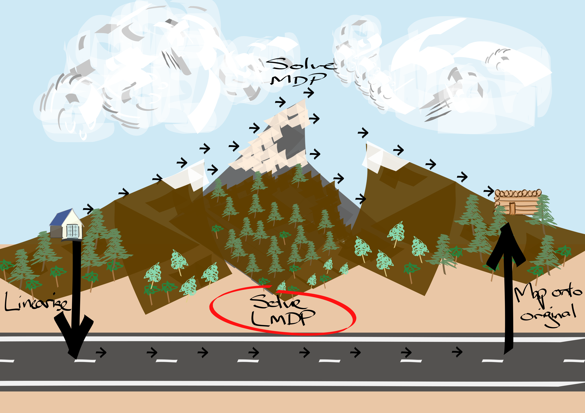
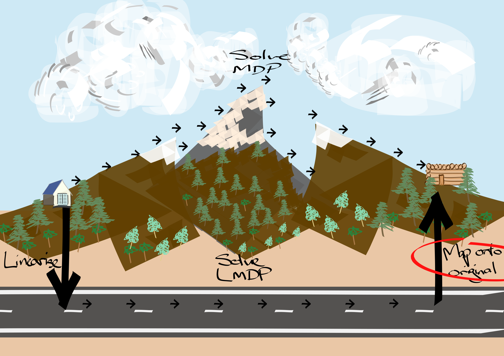

## LMDPs; more formally

{ width=450px }

Pick $a \in A$, versus, pick $\Delta(S)$. $f: S\to A$ vs $f:S \to \Delta(S)$.

In the original Todorov paper, they derive the LMDP equations for minimising a cost function. This maximisation derivation just changes a few negative signs around. Although there is also a change in the interpretation of what the unconstrained dynamics are doing. ...?

$$
\begin{align}
V(s) &= \mathop{\text{max}}_{u} q(s) - \text{KL}(u(\cdot| s) \parallel p(\cdot | s)) + \gamma \mathop{\mathbb E}_{s' \sim u(\cdot | s)} V(s') \tag{1}\\
\\
u^{* }(\cdot | s) &= \frac{p(\cdot | s)\cdot z(\cdot)^{\gamma}}{\sum_{s'} p(s' | s) z(s')^{\gamma}} \tag{8}\\
z_{u^{* }} &= e^{q(s)}\cdot P z_{u^{* }}^{\gamma} \tag{11}\\
\end{align}
$$

By definition, an LMDP is the optimisation problem in (1). (3) Define a new variable, $z(s) = e^{v(s)}$. (5) Define a new variable that will be used to normalise $p(s' | s)z(s')^{\gamma}$. (8) Set the optimal policy to minimise the KL distance term. (9) Since we picked the optimal control to be the form in (8), the KL divergence term is zero. (11) Rewrite the equations for the tabular setting, giving a $z$ vector, uncontrolled dynamics matrix.

(see appendix [] for a full derivation)

Main transformations of the LMDP, everything else follows.

1. Allow the direct optimisation of transitions, $u(s'|s)$, rather than policies.
1. $r(s, a) = q(s) + KL(P(\cdot|s, a)\parallel p(s'|s)), \forall s, a$
1. Set the optimal policy to be ...

Another way to frame. __Q:__ If we want to optimise the space of transitions, what augmentations of the MDP are necessary to ensure solutions in the LMDP are optimal in the MDP?

- Prove that 2. is necessary and sufficient for optimality. (probs not possible?!)

## A linearisation of an MDP

{ width=450px }
> How can we transform a MDP into a LMDP? While preserving the 'structure' of the MDP?

$$
\begin{align}
\forall s, s' \in S, \forall a \in A, \exists u_a& \;\;\text{such that;} \tag{1}\\
P(s' | s, a) &= u_a(s'|s)p(s'|s) \tag{2}\\
r(s, a) &= q(s) - \text{KL}(P(\cdot | s, a) \parallel u_a(\cdot| s) ) \tag{3}\\
\end{align}
$$

Which leads to $|A|$ linear equations to solve, for each state in the MDP.

See appendix [] for more details.

### Unconstrained dynamics

- What is their function?
- What do they look like?

Does it make sense to treat the q(s) like rewards?!
They reward for bing in state s.
But cant capture action specific rewards!?

## Decoding

{ width=450px }

Ok, so now we have disentangled the search for a policy and the search for optimal controls. At this point, we what what we want, but not how to get it.
This is where most of the complexity of the RL problem is?!?

We have discounted and pick the optimal state to be in.
(but what if the actual path we take to get there has a neg rewards?!?)

$$
P_{\pi}(\cdot | s) = \sum_a P_k(\cdot | s, a) \pi(a | s) \\
\pi = \mathop{\text{argmin}}_{\pi} \text{KL}\Big(u(\cdot | s))\parallel P_{\pi}(\cdot | s)\Big)
$$

Maybe this isnt enough? Do we need to add a reward sensitive part as well?!?

## Optimality of solutions via LMDPs

> Do these two paths lead to the same place?
<!-- insert quote?! -->

One of the main questions we have not addressed yet is; if we solve the MDP directly, or linearise, solve and project, do we end up in the same place? This is a question about the completeness of our abstraction. Can our abstraction represent (and find) the same solutions that the original can?

$$
\begin{align}
\parallel V_{\pi^{* }} - V_{\pi_{u^{* }}} \parallel_{\infty}&= \epsilon  \tag{1}\\
&=\parallel (I - \gamma P_{\pi^{* }})^{-1}r_{\pi^{* }} - (I - \gamma P_{\pi_{u^{* }}})^{-1}r_{\pi_{u^{* } }} \parallel_{\infty} \tag{2}\\
&\le\parallel (I - \gamma P_{\pi^{* }})^{-1}r - (I - \gamma P_{\pi_{u^{* }}})^{-1}r \parallel_{\infty} \tag{3}\\
&=\parallel \bigg((I - \gamma P_{\pi^{* }})^{-1} - (I - \gamma P_{\pi_{u^{* }}})^{-1} \bigg) r \parallel_{\infty} \tag{4}\\
&\le r_{\text{max}} \parallel (I - \gamma P_{\pi^{* }})^{-1} - (I - \gamma P_{\pi_{u^{* }}})^{-1}   \parallel_{\infty} \tag{5}\\
&= r_{\text{max}} \parallel \sum_{t=0}^{\infty} \gamma^t P_{\pi^{* }} - \sum_{t=0}^{\infty} \gamma^t P_{\pi_{u^{* }}}  \parallel_{\infty} \tag{6}\\
&= r_{\text{max}} \parallel \sum_{t=0}^{\infty} \gamma^t (P_{\pi^{* }} - P_{\pi_{u^{* }}})   \parallel_{\infty} \tag{7}\\
&= \frac{r_{\text{max}}}{1-\gamma} \parallel P_{\pi^{* }} - P_{\pi_{u^{* }}} \parallel_{\infty} \tag{7}\\
\end{align}
$$

(1) We want to compare the optimal policies value and the value achieved by the optimal LDMP solution.
(2) Assume that there exists a policy that can generate the optimal control dynamics (as given by the LMDP). In that case we can set $P_{\pi_{u^{* }}} = U^{* }$.
(3) $r_{u^{* }}$ doesnt really make sense as the reward is action dependent. We could calculate it as $r_{\pi_{u^{* } }}$, but we dont explicity know $\pi_{u^{* }}$. $(I - \gamma P_{\pi^{* }})^{-1}r$ represents the action-values, or $Q$ values. By doing this exhange, we might over estimate the diffference under the infinity norm as two non-optimal actions may have larger difference. Also, use the element wise infinity norm.

Notes

- why are we using the infinity norm?!!
- ?

What does $\delta \ge \text{KL}(P_{\pi^{* }} \parallel U^{* })$ imply about $\parallel P_{\pi^{* }} - P_{\pi_{u^{* }}} \parallel_{\infty}$?

***

$$
Q = r + \gamma P\cdot_{(s')} V \\
Q = (I - \gamma P_{\pi})^{-1} r ??? \\
$$

***

Ok, great.
Insights from optimality bounds.

Need to be able to approximate the optimal controls.
When is it hard to approximate the optimal controls?
When our basis set of distributions oer future states (aka our actions) have little weight...?

Potential solution?
Use options.

### Option decoding

What about using options to help solve the optimal control decoding?
Does this actually help?!

$$
P_{\pi}(\cdot | s) = \sum_\omega P_k(\cdot | s, \omega) \pi(\omega | s) \\
\pi = \mathop{\text{argmin}}_{\pi} \text{KL}\Big(u(\cdot | s))\parallel P_{\pi}(\cdot | s)\Big)
$$

Options would allow greater flexibility in the $P_{\pi}(\cdot | s)$ distribution, making is possible to match $u(s'|s)$ with greater accuracy (and possibly cost).

- First need to demonstrate that action decoding is lossy.
- Then show that using options is less lossy.

## The complexity of solutions via LMDPs

> Is my path actually shorter?

The whole point of this abstraction was to make the problem easier to solve. So hasit actually made it any easier?

The complexity of solving our abstraction can be broken down into the three steps;

- linearisation:  $|S| \times \text{min}(|S|,|A|)^{2.3}$
- solve the LMDP: $\text{min}(|S|,|A|)^{2.3}$
- project back: $???$

Giving a total complexity of ...

Contrasted with the complexity of solving an MDP.

## Scaling to more complex problems

Now that we have some evidence that this LMDP solution strategy makes sense, it efficiently (see [complexity]()) yields high value (see [optimality]()) policies.
We want to test it out on some real world problems.
But the real world isn't as nice as the setting we have been working in. There are a few added complexities;

- sample based / incremental
- large / cts state spaces
- sparse rewards
<!-- more?!? -->

### Incremental implementation

Generalise to a more complex problem. We are only given samples.
A first step to tackling more complex problems.

##### Model based
Learn $p, q$ based on samples.

$$
\mathcal L(\theta, \phi) = \mathop{\mathbb E}_{s, a,} \bigg[ r(s, a) - q_\theta(s) + \text{KL}(p_\phi(\cdot | s) \parallel P(\cdot | s, a)) \bigg]\\
\mathcal L(\theta, \phi) = \mathop{\mathbb E}_{s, r, s'} \bigg[r - q_\theta(s) - p_\phi(s' | s) \log \frac{1}{ p_\phi(s' | s)} \bigg] \\
$$

##### Model free

$z$-iterations. But we need to find a way to project $(s_t, a_t, r_t) \to (x_t, p_t, q_t)$.

- Is there a way to construct $p, q$ incrementally!?!?
- What is the essence of what is being done here?

***

Alternative perspective. The high value trajectories are the most likely ones.

### Distributions over states

What if we wanted to approximate these distributions?
Generalise subgoal methods to work with distributions?
The distribution could be constructed via; parzen window / GMM, neural flow, ?!.

Connections to distributional RL?

Questions

- What is p(s'|s)!?!?
- Want some examples of MDPs they cannot solve.
- What is the relationship to other action embedding strategies?
- How does p(s'|s) bias the controls found??? I can imagine the unconstrained dynamics acting as a prior and prefering some controls over others.
- If we have m states and n actions. Where m >> n. Then $u(s'|s)$ is much larger than $\pi(a|s)$. Also, $u(s'|s)$ should be low rank?! $u_{s's} = \sum_a u_a \alpha_a u_a^T$

## Other properties

LMDPs have the property that if we have already solved two LMDPs, with the same state space, action space, unconditioned transition dynamics, but different state rewards, $q_1, q_2$. Then we can solve a new LMDP, again with the same, ..., and state rewards in the span of $q_1, q_2$, $z_3 = w_1 z_1 + w_2 z_2$, ...

Problem. What does it even mean for two LMDPs to have the same unconditioned dynamics but different state rewards?
The MDPs must have been the same up to some additive constant (constant in the actions), $r(s, a)=r(s, a) + c(s)$.
Does this really capture what we mean by different tasks?!?

AND HRL!?!?

Refs

- [Efficient computation of optimal actions](https://www.pnas.org/content/106/28/11478)
- [Linearly-solvable Markov decision problems](https://homes.cs.washington.edu/~todorov/papers/TodorovNIPS06.pdf)
- [Moving Least-squares Approximations for Linearly-solvable MDP](https://ieeexplore.ieee.org/stamp/stamp.jsp?arnumber=5967383)
- [Aggregation Methods for Lineary-solvable Markov Decision Process](https://homes.cs.washington.edu/~todorov/papers/ZhongIFAC11.pdf)
- [A Unifying Framework for Linearly Solvable Control](https://arxiv.org/abs/1202.3715)
- [A Stability Result for Linear Markov Decision Processes](http://www.optimization-online.org/DB_FILE/2017/03/5893.pdf)
