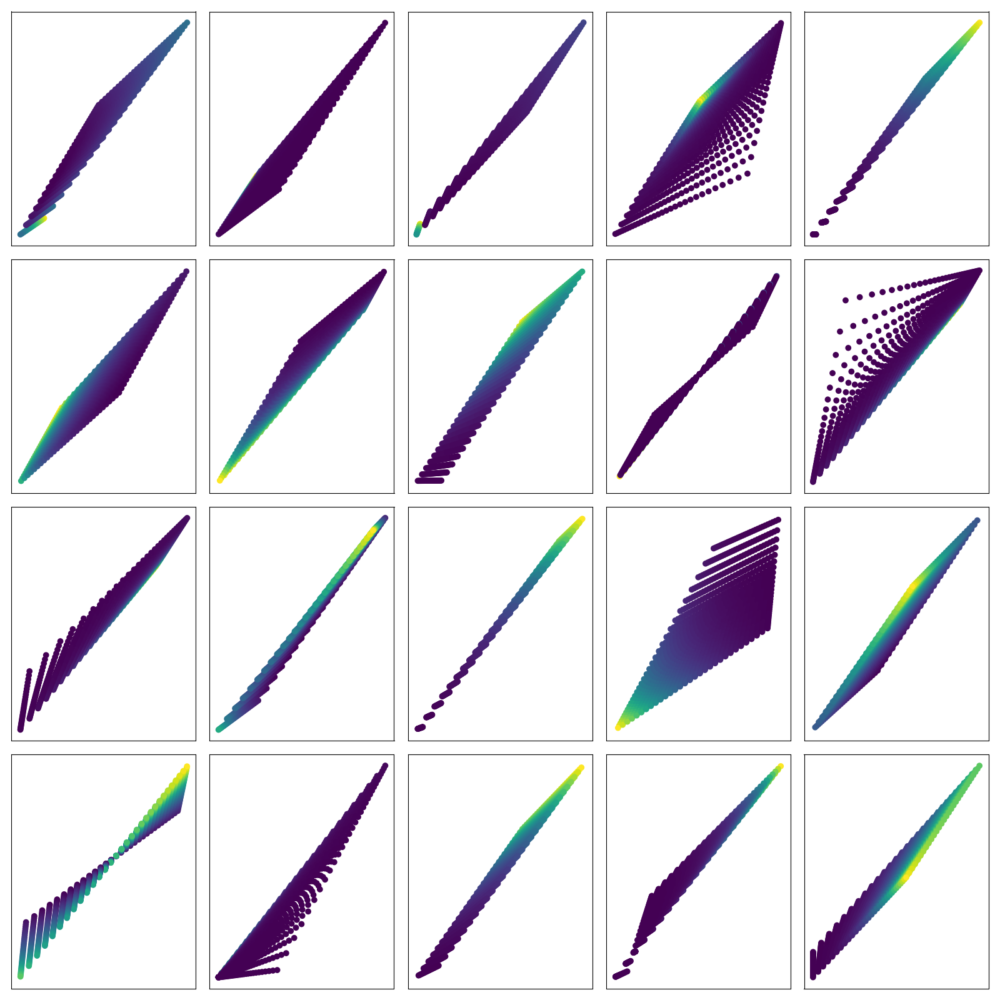

# The value function polytope

- How does the distribution of policies on the polytope effect learning?
- How does gamma change the shape of the polytope?
- How do the dynamics of GPI partition the policy / value spaces?

## Distribution of policies

A potentially interesting question to ask about the polytopes is how the policies are distributed over the polytope. To calculate this analytically, we can use the probability chain rule: $p(f(x)) = \mid \det\frac{\partial f(x)}{\partial x}\mid^{-1}p(x)$. Where we set $f$ to be our value functional and $p(x)$ to be a uniform distribution.

<!-- NOTE: Only works when `n_actions == n_states`, unless we use $det|A| = \sqrt{det|A^2|}$ to estimate the `det` of a non square matrix!? -->

{ width=450px }

- __Observation__ In some polytopes, many of the policies are close to the optimal policy. In other polytopes, many of the policiesare far away from the optimal policy. __Question__ Does this make the MDP harder or easier to solve? __Intuition__ If there is a high density near the optimal policy then we could simply sample policies and evaluate them. This would allow us to find a near optimal policy with relative easy.
- __Observation__ The density is always concentrated / centered on an edge.
- __Question__ how does the entropy of the distribution change under different gamma/transitions/rewards...?

***

__Derivation of derivative__

$$
\begin{align}
V(\pi) &= (I − \gamma P_{\pi})^{−1}r_{\pi} \\
&= (I − \gamma P\cdot \pi)^{−1}r\cdot \pi \\
\frac{\partial V}{\partial \pi} &= \frac{\partial}{\partial \pi}((I-\gamma P_{\pi})^{-1} r_{\pi}) \\
&= (I-\gamma \pi P)^{-1} \frac{\partial \pi r}{\partial \pi}+   \frac{\partial (I-\gamma \pi P)^{-1}}{\partial \pi}\pi r\tag{product rule} \\
&= (I-\gamma \pi P)^{-1} r + -(I-\gamma \pi P)^{-2} \cdot -\gamma P\cdot \pi r\\
&= \frac{r}{I-\gamma \pi P} + \frac{ \gamma P\cdot \pi r}{(I-\gamma \pi P)^2}\\
&= \frac{r(I-\gamma \pi P) + \gamma P \pi r}{(I-\gamma \pi P)^2} \\
& = \frac{r}{(I-\gamma P \pi)^2}
\end{align}
$$


#### An MDPs Entropy

(_the goal is to understand what makes some MDPs harder to solve than others_)

We can visualise polytopes in 2D, but we struggle in higher dimensions. However, it is possible to use lower dimensions to gain intuition about metrics and carry that intuition into higher dimensions. A potential metric of interest here is the entropy of our distribution, (and / or  the expected distance from the optima) to give intuition about unimaginable MDPs.

$$
\begin{align}
M &\to \{P, r, \gamma\} \tag{a MDP}\\
H(M) &:= \mathop{\mathbb E}_{\pi\sim\Pi}\Big[-\log p(V(\pi)) \Big]\\
&= \mathop{\mathbb E}_{\pi\sim\Pi}\Big[-\log(\mid \det\frac{\partial V(\pi)}{\partial \pi}\mid^{-1}p(\pi)) \Big] \\
&= \mathop{\mathbb E}_{\pi\sim\Pi}\Big[-\log(\mid \det \frac{r}{(I-\gamma P \pi)^2}\mid^{-1}p(\pi)) \Big] \\
\end{align}
$$

What does this tell us? __???__ A MDP with a low entropy tells us that many of the policies are in a corner of the polytope. But the 'hardness' of the MDP depends on which corner these policies are concentrated in. Rather we could use the value of each policy to give information about the location of the policy.


\begin{align}
\mu(M) &:= \mathop{\mathbb E}_{\pi\sim\Pi}\Big[V(\pi) \Big]\\
\end{align}


What does this tell us? The expected value of a policy. Thus, a quantity of interest might be the expected suboptimality of a policy, $s = V(\pi^{* })-\mu(M)$. This tells us how far away the optimal policy is from the center of mass of the polytope.

__Conjecture:__ If an MDP has suboptimality $s \le \frac{\sigma_{MDP}}{D}$ then it is possible to find a $\epsilon$ optimal policy with $\mathcal O(n)$ samples. (but sampling in high dimensions always scales badly?!)


__Experiment:__ Correlate the properties of $P, r$ with entropy. Or find derivative wrt $P, r$. What properties of $P, r$ yield easily solvable MDPs?

NOTE:

- What about the variance of the MDP? What does that tell us?
- How does a uniform distribution on a simplex behave in high dimensions? Does it become more likely to sample from the center? Less likely to sample from vertices??

## Discounting

How does the shape of the polytope depend on the discount rate? Given an MDP, we can vary the discount rate from $0$ to $1$ and explore how the shape of the value polytope changes.

{ width=450px }

- __Observation__ As $\gamma \to 1$, all the policies are projected into a 1D space? __Question__ Does this make things easier to learn? __Intuition__ Orderd 1D spaces are easy to search.
- __Observation__ The tranformation that changing the discount applies is quite restricted. They are not generally non-linear, but appear 'close to linear', but not quite. __Question__ What is the set of functions /transformations that the discount can apply?

<!--
\begin{align}
V(\gamma) &= (I − \gamma P_{\pi})^{−1}r_{\pi} \\
\\
f(x + y) &= f(x)+f(y) \\
f(ax) & =af(x) \\
\\
V(\alpha \gamma) &= (I − \alpha\gamma P_{\pi})^{−1}r_{\pi} \\
&= \alpha(\alpha^{-1}I − \gamma P_{\pi})^{−1}r_{\pi} \\
\alpha V(\gamma) &\neq \\
\\
V(\alpha + \beta) &= (I − \gamma P_{\pi})^{−1}r_{\pi} \\
&= (I − (\alpha + \beta) P_{\pi})^{−1}r_{\pi} \\
&= (I − \alpha P_{\pi} - \beta P_{\pi})^{−1}r_{\pi} \\
\end{align}
 -->


<!-- NOTE

- what if we were using hyperbolic discounting instead?
- Can we think of $\gamma$ as group with representation in $GL(n)$ acting on it?! -->

## Dynamics

(we want to know how much it costs to find the optima)

For each initial policy, we can solve / optimise it to to find the optimal policy (using policy iteration). Here we count how many iterations were required to find the optima (from different starting points / policies).

<!-- Policy iteration can be summarised easily as an iteration between evaluation and updates, see below.

```
pi = init
while not converged:
  value = evaluate(pi)
  pi = greedy_update(value)
``` -->

{ width=450px }

- __Observation__ Two policies can be within $\epsilon$ yet requires more iterations of GPI. __Question__ Why are some initial points far harder to solve than others, despite being approximately the same?
- __Observation__ With only 2 states and 2 actions, it is possible for 3 partitions to exist. (2,3,4 steps), (2,3,2 steps). __Questions__ ???
- __Observation__ Sometimes the iterations don't converge. (a bug in the code?)

<!-- NOTES:

- What are the best ways to travel through policy space? (lines of shortest distance?!)
- How does this scale with `n_actions` or `n_states`??
- Is there a way to use an interior search to give info about the exterior? (dual methods?!)
- What if your evaluations are only $\epsilon$-accurate? How does that effect things?!? -->
