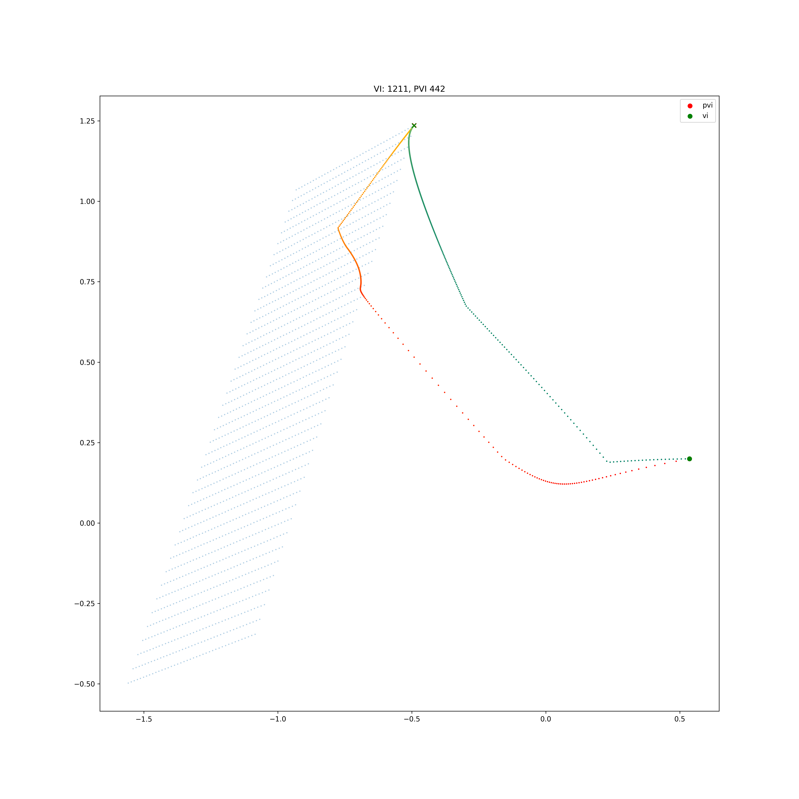
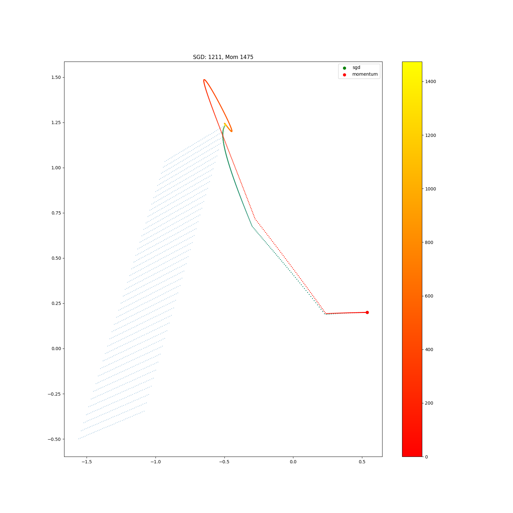
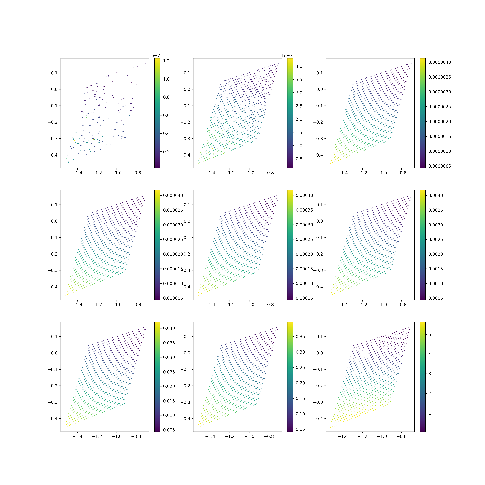
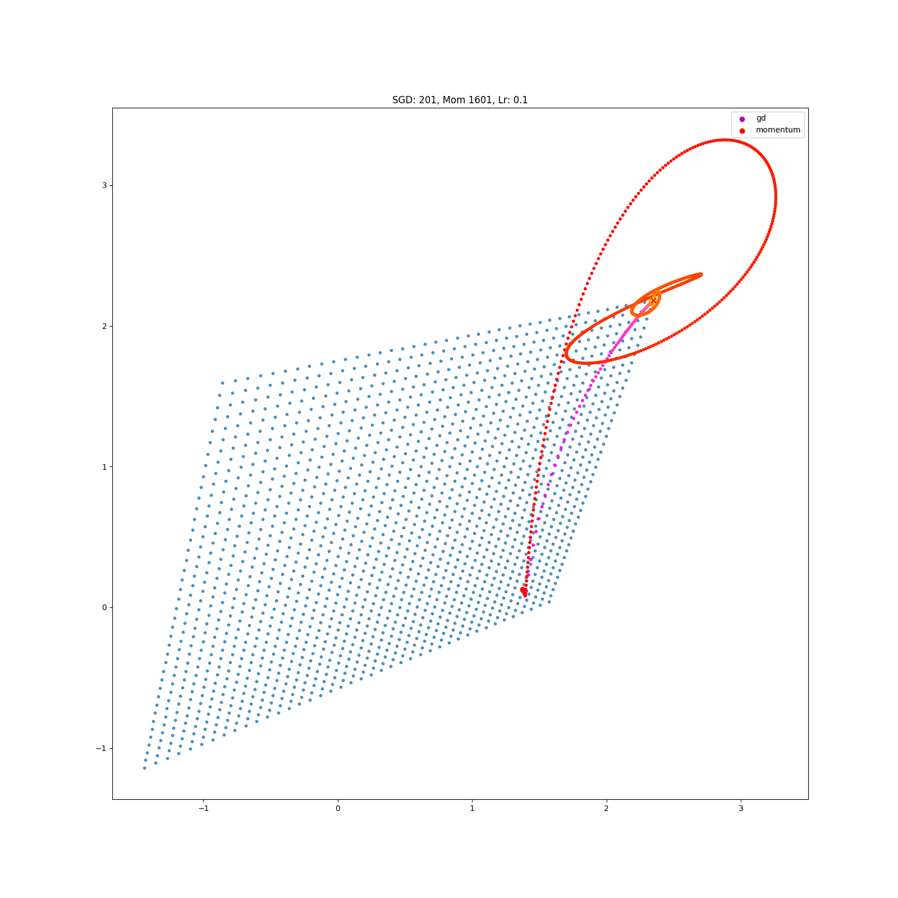
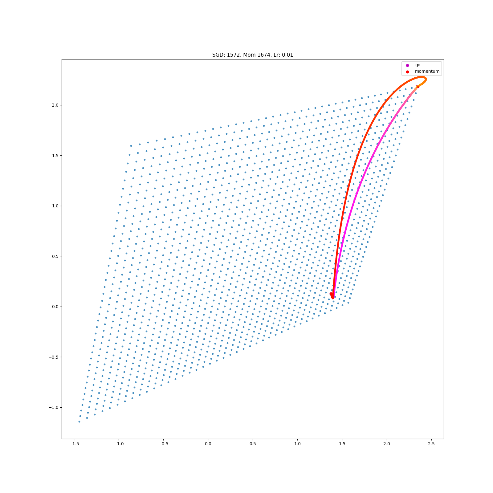
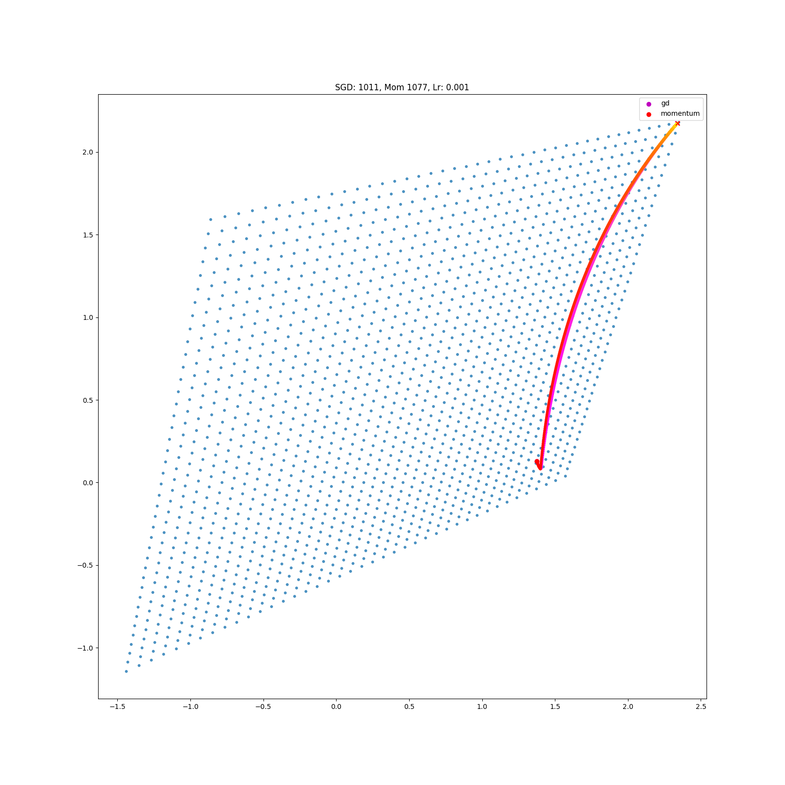

## Search spaces and gradient descent

We want to find the optimal policy given some MDP. But how should we search for this policy? We could search within set of potentially optimal policies, the $|A|^{|S|}$ discrete policies, or we could search within the set of possible value functions, $\mathbb R^{|S|}$, or maybe some other space. Which space allows us to find the optimal policy in the cheapest manner?

Naively, we know that smaller search spaces are better. We would rather search for our keys in a single room, rather than many. But added structure (for example, continuity) can be exploited to yield faster search, even when there are infinitely more states to search.

In RL we know that;
- the values must satisfy the bellman optimality criteria. This structure can be exploted.
- the policies ...?

#### Value iteration

In RL it is possible to transform the hard combinatorial problem of searching through the $|A|^{|S|}$ possible discrete policies, into an easier (how do we know it is easier?!? PROOF) problem, a search through all possible policies $?!?$.

#### Policy iteration

When transforming between two spaces, how does the optimisation space change?
Does my abstraction make optimisation easier?

#### Model iteration

Search through possible models, $\tau, r$, calculate the optimal policy $\pi^{* }_{\tau, r}$ and then update $\tau, r$ based on $\parallel V_{\tau, r}(\pi^{* }) - V(\pi^{* }) \parallel$.

Search through models while trying to find one that yields similar returns to the oracle when playing the same policy.

(note this one is different to the others. as we dont assume we know the model)
Related to Thompson sampling?!?

Model iteration. Model invariant transforms. Pick a policy. Falsify it, and this falsify all models that yield the same optimal policy.

***

More generally, I am interested in how searches in different spaces, whether the value, the policy, or some parameters, ...

Let's focus on gradient descent.

\begin{align}
w_{t+1} = w_t - \eta \nabla f(w_t) \\
\end{align}

It's dynamics are depentdent on the topology of its loss landscpace, which is determined by the search space and .

Thus phrased differently, the original becomes: how does the space we are searching within effect the search dynamics: the rate of convergence and the possible trajectories.

\begin{align}
&\mathop{\text{max}}_V \mathop{\mathbb E}_{s\sim D} V(s) \\
&\mathop{\text{max}}_{\pi} \mathop{\mathbb E}_{s\sim D}V^{\pi}(s) \\
&\mathop{\text{max}}_{\theta} \mathop{\mathbb E}_{s\sim D} V_{\theta}(s) \\
&\mathop{\text{max}}_{\theta} \mathop{\mathbb E}_{s\sim D} V^{\pi_{_{\theta}}}(s) \\
&\mathop{\text{max}}_{\phi} \mathop{\mathbb E}_{s\sim D} V^{\pi_{_{\theta_{\phi}}}}(s) \\
&\mathop{\text{max}}_{\varphi} \mathop{\mathbb E}_{s\sim D} V^{\pi_{_{\theta_{\phi_{\varphi}}}}}(s) \\
\end{align}

We can pick the space we optimise in. Why would we want to pick one space over another?

- In which spaces can we do gradient descent?
- In which spaces can we do convex optimisation?
- In which spaces does momentum work well?
- ...

### Topology and dynamics

Ok, so if we parameterise our search space. We have now changed the topology of our search space.

__Q:__ How can we rationally pick the topology of our search space to accelerate learning?

- A well connected space? For all possible policies, there exists $\theta_1, \theta_2 \text{ s.t. } \parallel \theta_1- \theta_2\parallel_2$ is small. (but that doesnt necessarily help... depends on the landscapce imposed by $\nabla_{\theta} V$)
- ???

See these gradient flows for example;

Pics?!?

Here are some examples ...???

{ width=300px }

{ width=300px }

If we overparameterise the search space, then we can move between solutions in new ways. We can 'tunnel' from A to B, without crossing C.

Intuition: Every point is closer, under some measure of distance?!?
But. Momentum seems like it might be a bad thing here?

### Accleration and parameterisation

Intuition. Something weird happens with momentum in overparameterised spaces.

It is necessary to consider the trajectory to study momentum. It depends on what has happened in the past.
Can we construct a space of possible trajectories?
What properties do trajectories have? They are connected by the update fn.

### Continuous flow and its discretisation

A linear step of size, $\alpha$, in parameter space, ie by gradient descent, is not necessrily a linear step in parameter space.

<!-- { width=300px } -->

{ width=200px }
{ width=200px }
{ width=200px }

This is consistent with acceleration of gradient descent being a phenomena only possible in the discrete time setting.
[On symplectic optimization](https://arxiv.org/abs/1802.03653).

This phenomena can be explained by the exponential decay of the momentum terms.

\begin{align}
m_{t+1} = m_t + \gamma\nabla f(w_t) \\
w_{t+1} = w_t - \eta (1-\gamma) m_{t+1} \\
\end{align}

As $\eta \to 0$, $(1-\gamma) \cdot m_{t+1} \to \nabla f(w_t)$.

TODO, prove it.
