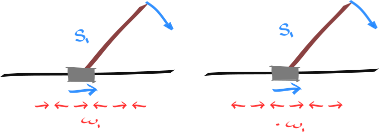

## Cart pole

### Mirror symmetry

<!-- What is this mirror around? Where is it? -->

Two indicators of this symmetry. It is reflected in the transition function, and the value function.

The change in state is conserved between the pair.

\begin{align}
\Delta(s, a) = \mathop{\mathbb E}_{s' \sim p(\cdot| s, a)} (s' - s) \\
\Delta(s_1, a_1) = - \Delta(s_2, a_2) \\
\end{align}

The expected value is conserved between the pair (assuming we have a policy with mirror symmetry).

\begin{align}
\forall a \text{ set}\;\;\pi(a | s_1) = \pi(-a| s_2) \\
\forall \gamma: Q^\gamma_\pi(s_1, a_1) = Q^\gamma_\pi(s_2, a_2) \\
\forall \gamma: Q^\gamma_\pi(s_1, a_2) = Q^\gamma_\pi(s_2, a_1) \\
\end{align}

The (discounted) reachable rewards are conserved between the pair. (!!!)

\begin{align}
\{r(s, a, s'): \forall s \in \mathcal R(s_1, a_1)\} = \{r(s, a, s'): \forall s \in \mathcal R(s_2, a_2)\}
\end{align}

### Translational symmetry

(special case of regular actions)

\begin{align}
\Delta(s_1, a_1) = \Delta(s_1, a_2) = \Delta(s_2, a_1) = \Delta(s_2, a_2) \\
\forall a \text{ set}\;\;\pi(a | s_1) = \pi(a| s_2) \\
\forall \gamma: Q^\gamma_\pi(s_1, a_1) = Q^\gamma_\pi(s_2, a_2)= Q^\gamma_\pi(s_1, a_2) = Q^\gamma_\pi(s_2, a_1), \\
\end{align}

### Future translational symmetry

different states, different actions. but maps into translational symmetry.

After this action. All future actions will have the same effect. In this sense, these two state-actions are similar.

\begin{align}
\forall a: \mathop{\mathbb E}_{s' \sim p(\cdot| s_1, a_1)} [\Delta(s', a)] =  \mathop{\mathbb E}_{s' \sim p(\cdot| s_2, a_2)} [\Delta(s', a)] \\
\end{align}

### Temporal mirror symmetry

This is simply a result of the eariler mirror symmetry?!? (want to show this!)

permutations of actions that yield similar outcomes.

\begin{align}
p(s'|s, \omega) = \prod p(s|s, a)\omega(a|s) \\
p(\cdot|s_1, \omega_1) = p(\cdot|s_1, \omega_2) \\
Q(s_1, \omega_1) = Q(s_1, \omega_2) \\
\end{align}
