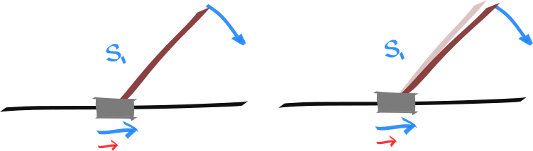
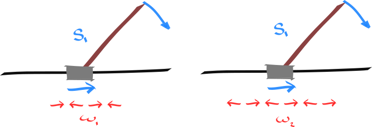

### Cart pole

#### Mirror symmetry

<!-- What is this mirror around? Where is it? -->

$$
\begin{align}
\Delta_{\tau}(s, a) = \mathop{\mathbb E}_{s' \sim p(\cdot| s, a)} (s' - s) \\
\Delta_{\tau}(s_1, a_1) = - \Delta_{\tau}(s_2, a_2) \\
\end{align}
$$

(_this assumes we have a 'nice' state representation where differenes make sense_)

$$
\begin{align}
\Delta_{T}(s, a) = (T \circ Q)(s,a) - Q(s,a)\\
\Delta_{T}(s_1, a_1) = \Delta_{T}(s_2, a_2) \\
\end{align}
$$

The expected value is conserved between the pair (assuming we have a policy with mirror symmetry).

$$
\begin{align}
\text{ set}\;\;\pi(a | s) = \pi(-a| -s) \\
Q_\pi(s_1, a_1) = Q_\pi(s_2, a_2) \\
Q_\pi(s_1, a_2) = Q_\pi(s_2, a_1) \\
\end{align}
$$

The (discounted) reachable rewards are conserved between the pair. (!!!)

$$
\begin{align}
\{r(s, a, s'): \forall s \in \mathcal R(s_1, a_1)\} = \{r(s, a, s'): \forall s \in \mathcal R(s_2, a_2)\}
\end{align}
$$

#### Translational symmetry

(special case of regular actions)

$$
\begin{align}
\Delta_{\tau}(s_1, a_1) = \Delta_{\tau}(s_1, a_2) = \Delta_{\tau}(s_2, a_1) = \Delta_{\tau}(s_2, a_2) \\
 \text{ if} \;\;\forall a\;\;\pi(a | s_1) = \pi(a| s_2) \\
Q_\pi(s_1, a_1) = Q_\pi(s_2, a_2)= Q_\pi(s_1, a_2) = Q_\pi(s_2, a_1) \\
\end{align}
$$

### Local symmetry

(_this is approximately a symmetry_)

$$
\begin{align}
\Delta(s_1, a_1) = \Delta(s_1, a_2) = \Delta(s_2, a_1) = \Delta(s_2, a_2) \\
\forall a \text{ set}\;\;\pi(a | s_1) = \pi(a| s_2) \\
Q_\pi(s_1, a_1) \approx Q_\pi(s_2, a_2)  \\
\end{align}
$$

### Future translational symmetry

different states, different actions. but maps into translational symmetry.

After this action. All future actions will have the same effect. In this sense, these two state-actions are similar.

$$
\begin{align}
\forall a: \mathop{\mathbb E}_{s' \sim p(\cdot| s_1, a_1)} [\Delta(s', a)] =  \mathop{\mathbb E}_{s' \sim p(\cdot| s_2, a_2)} [\Delta(s', a)] \\
\end{align}
$$

#### Temporal mirror symmetry

This is simply a result of the earlier mirror symmetry?!? (want to show this!)

permutations of actions that yield similar outcomes.

$$
\begin{align}
p(s'|s, \omega) = \prod p(s|s, a)\omega(a|s) \\
p(\cdot|s_1, \omega_1) = p(\cdot|s_1, -\omega_1) \\
Q_{\pi}(s_1, \omega_1) = Q_{\pi}(s_1,-\omega_1) \\
\end{align}
$$

#### Temporal symmetry

$$
\begin{align}
p(\cdot|s_1, \omega_1) = p(\cdot|s_1, \omega_2) \\
Q_{\pi}(s_1, \omega_1) = Q_{\pi}(s_1,\omega_2) \\
\end{align}
$$

### Pong

#### Mirror symmetry (vertical)

(_how can a change in state be evaluated? we need a representation..._)

$$
\begin{align}
\Delta_{T}(s, a) = (T \circ Q)(s,a) - Q(s,a)\\
\Delta_{T}(s_1, a_1) = \Delta_{T}(s_2, a_2) \\
\end{align}
$$

$$
\begin{align}
\forall a \text{ set}\;\;\pi(a | s_1) = \pi(-a| s_2) \\
Q_\pi(s_1, a_1) = Q_\pi(s_2, a_2) \\
Q_\pi(s_1, a_2) = Q_\pi(s_2, a_1) \\
\end{align}
$$

#### Mirror symmetry (horizontal)

Upon pretending to play as your opponent (flipping the image and inverting the colors, via $\rho: O \to O$, and ??? the actions)

$$
\begin{align}
Q(s_1, a_1) = - V(\rho(s_2)) \\
\end{align}
$$

(_this really requires you to disentangle the model from your opponent!?_)

$$
\begin{align}
\tau(s'|s, a_{p=0}) &= f_{p=0}(s''|s, a) \cdot f_{p=1}(s'|s'', \hat a) \cdot \pi_{p=1}(\hat a|s'') \\
Q_{p=0}(s, a) &= -Q_{p=1}(s, a)
\end{align}
$$

#### Translational symmetry

(_although there are boundary cases which cannot be ignored. how can they be dealt with!?_)

$$
\begin{align}
\forall a: Q_{\pi_1}(s_1, a) = Q_{\pi_2}(s_2, a) \\
\forall a, t: \pi_1(a|s^t_{s^0=s_1}) = \pi_2(a|s^t_{s^0=s_2})
\end{align}
$$

If we take the same actions, in translated states, we get the same outcome (up to the boundary conditions).

#### Temporal symmetries

$$
\begin{align}
\exists \pi_1, \pi_2 \;\;\text{s.t.} \;\; Q^{\pi_1}(s_1, a_1) = Q^{\pi_2}(s_2, a_2)
\end{align}
$$

The same future state can be reached, and thus the same rewards can be achieved.
