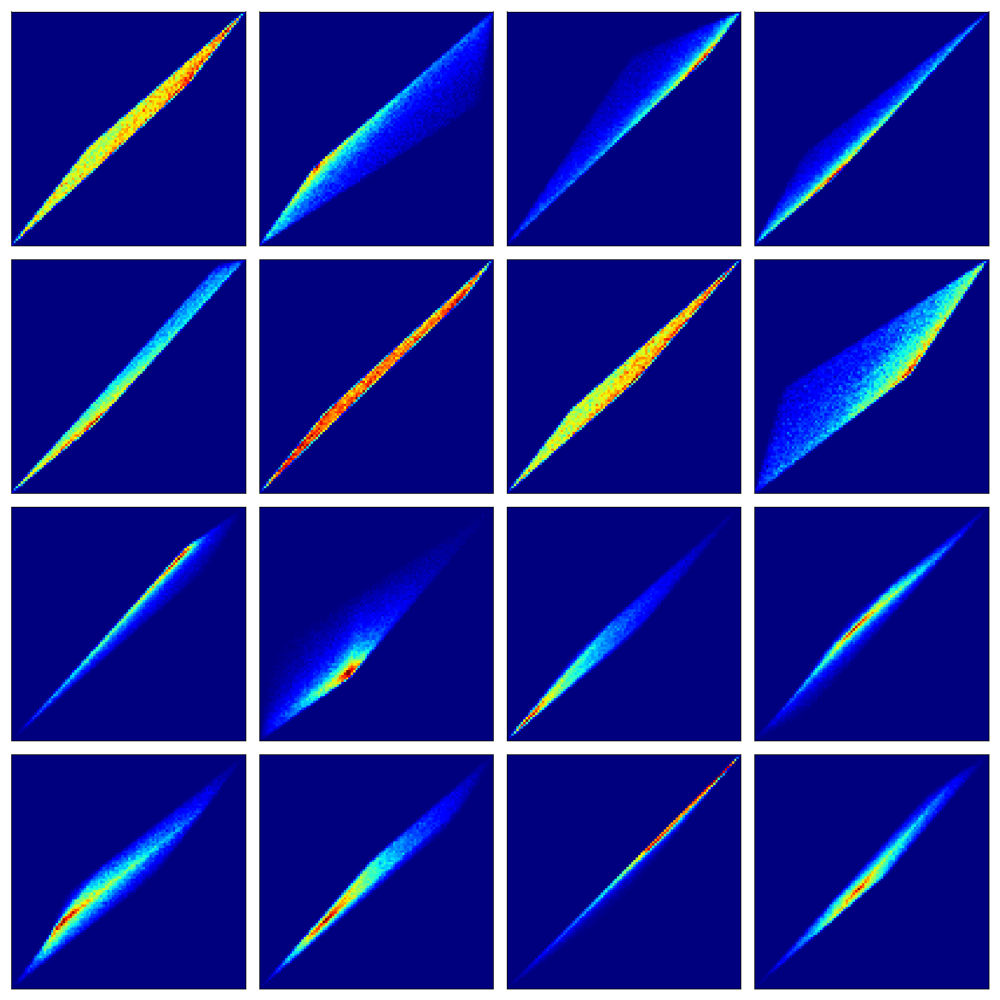

## The value function polytope

Summary of [The Value Function Polytope in Reinforcement Learning](https://arxiv.org/abs/1901.11524).

Questions

- What does the density of the polytopes look like?
- How does gamma change the geometry an dynamics?
- How do the dynamics partition space?

### Entropy

#### The distribution of policies

{ width=250px }

__Question__ Can we charachterise how hard a problem is by how many of the policies lie far away from the optima?
Is easy as the densest area of policy space is close to the optima!?

A measure of how many policies are near optimal.

why do these look to be so sparse near the optima?
can we estimate how suboptimal the avgerage policy is!?
like a measure of variance for the MDP!?
What if one has far lower entropy than the others!?

__Question__ how does the entropy of the distribution change under different gamma/transitions/rewards...?

Attempting to derive density using the probability chain rule $p(f(x)) = \mid \det\frac{\partial f(x)}{\partial x}\mid^{-1}p(x)$

Does using $p(x) =$ uniform simplify this?

$$
\begin{align}
V(\pi) &= (I − \gamma P_{\pi})^{−1}r_{\pi} \\
&= (I − \gamma P\cdot \pi)^{−1}r\cdot \pi \\
\frac{\partial V}{\partial \pi} &= \frac{\partial}{\partial \pi}((I-\gamma P_{\pi})^{-1} r_{\pi}) \\
&= (I-\gamma \pi P)^{-1} \frac{\partial \pi r}{\partial \pi}+   \frac{\partial (I-\gamma \pi P)^{-1}}{\partial \pi}\pi r\tag{product rule} \\
&= (I-\gamma \pi P)^{-1} r + -(I-\gamma \pi P)^{-2} \cdot -\gamma P\cdot \pi r\\
&= \frac{r}{I-\gamma \pi P} + \frac{ \gamma P\cdot \pi r}{(I-\gamma \pi P)^2}\\
&= \frac{r(I-\gamma \pi P) + \gamma P \pi r}{(I-\gamma \pi P)^2} \\
& = \frac{r}{(I-\gamma P \pi)^2}
\end{align}
$$

Only works when `n_actions == n_states`!?

### Dynamics

- How much does it cost for us to find the optima?
- What are the best ways to travel through policy space? (lines of shortest distance?!)
- Why are some initial points far harder to solve than others?

#### Policy iteration

What is it?

__Questions__

- How does this scale with `n_actions` or `n_states`??
- How does the number of steps partition space?
- Is there a way to use an interior search to give info about the exterior? (dual methods?!)
- What is your evaluation is only $\epsilon$-accurate? How does that effect things?!?
Or some assumptions that canbe made while only knowing a subset of the exterior points?
