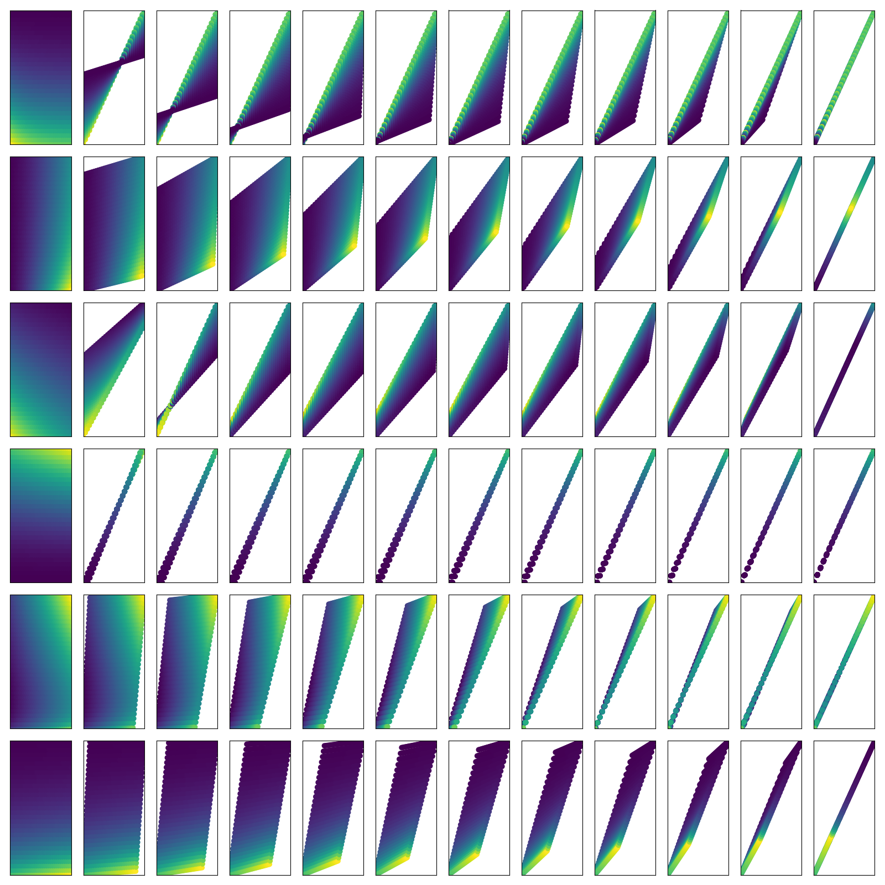
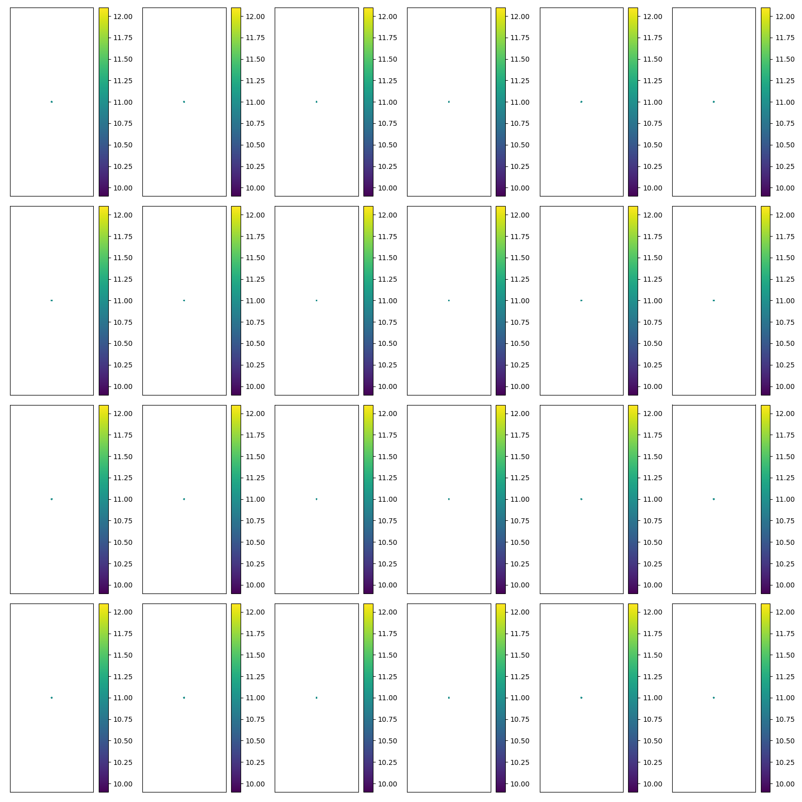

## The value function polytope

Summary of [The Value Function Polytope in Reinforcement Learning](https://arxiv.org/abs/1901.11524).

$$
\begin{align}
V &= r_{\pi} + \gamma P_{\pi} V \\
V - \gamma P_{\pi} V &= r_{\pi}\\
(I-\gamma P_{\pi})V &= r_{\pi}\\
V &= (I-\gamma P_{\pi})^{-1}r_{\pi}\\
\end{align}
$$

Questions

- How does the distribution of policiess on the polytope effect learning?
- How does gamma change the shape of the polytope?
- How do the dynamics partition space?

### Distribution of policies

The polytopes above are quite interesting. An interesting question to ask about the polytopes is how the policies are distributed over the polytope.

If many policies are close to the optimal policy, does this make it easier to solve?
Also, how does

__Question__ how does the entropy of the distribution change under different gamma/transitions/rewards...?

{ width=250px }

__Derivation of density__

Attempting to derive density using the probability chain rule $p(f(x)) = \mid \det\frac{\partial f(x)}{\partial x}\mid^{-1}p(x)$

Does using $p(x) =$ uniform simplify this?

$$
\begin{align}
V(\pi) &= (I − \gamma P_{\pi})^{−1}r_{\pi} \\
&= (I − \gamma P\cdot \pi)^{−1}r\cdot \pi \\
\frac{\partial V}{\partial \pi} &= \frac{\partial}{\partial \pi}((I-\gamma P_{\pi})^{-1} r_{\pi}) \\
&= (I-\gamma \pi P)^{-1} \frac{\partial \pi r}{\partial \pi}+   \frac{\partial (I-\gamma \pi P)^{-1}}{\partial \pi}\pi r\tag{product rule} \\
&= (I-\gamma \pi P)^{-1} r + -(I-\gamma \pi P)^{-2} \cdot -\gamma P\cdot \pi r\\
&= \frac{r}{I-\gamma \pi P} + \frac{ \gamma P\cdot \pi r}{(I-\gamma \pi P)^2}\\
&= \frac{r(I-\gamma \pi P) + \gamma P \pi r}{(I-\gamma \pi P)^2} \\
& = \frac{r}{(I-\gamma P \pi)^2}
\end{align}
$$

NOTE: Only works when `n_actions == n_states`!?

#### An MDPs Entropy

While it is possible to visualise polytopes in 2D, we struggle in higher dimensions. However, it is possible to use the entropy of our distribution, (and / or  the expected distance from the optima) to give intuition about unimaginable MDPs.

$$
\begin{align}
M &\to \{P, r, \gamma\} \tag{a MDP}\\
H(M) &:= \mathop{\mathbb E}_{\pi\sim\Pi}\Big[-\log p(V(\pi)) \Big]\\
&= \int_{\pi\in\Pi} p(V(\pi)) \cdot -\log p(V(\pi))d\pi \\
\end{align}
$$

What does this tell us? Low entropy tells us that many of the policies are in a corner of the polytope.

$$
\begin{align}
\mu(M) &:= \mathop{\mathbb E}_{\pi\sim\Pi}\Big[V(\pi) \Big]\\
\end{align}
$$

What does this tell us? Where is the center of mass? The expected value of a sampled policy.

A quantity of interest might be the average suboptimality of a policy, $s = V(\pi^{* })-\mu(M)$. This tells us how far away the optimal policy is rom the center of mass of the polytope.

What about variance?

#### In high dimensions.

It becomes more likely to sample from the center? Less likely to sample from vertices??
But we are using a uniform distribution?? How does this behave in high dims!?

### Discounting

Looks like a linear transformation.

$$
\begin{align}
V(\gamma) &= (I − \gamma P_{\pi})^{−1}r_{\pi} \\
\\
f(x + y) &= f(x)+f(y) \\
f(ax) & =af(x) \\
\\
V(\alpha \gamma) &= (I − \alpha\gamma P_{\pi})^{−1}r_{\pi} \\
&= \alpha(\alpha^{-1}I − \gamma P_{\pi})^{−1}r_{\pi} \\
\alpha V(\gamma) &\neq \\
\\
V(\alpha + \beta) &= (I − \gamma P_{\pi})^{−1}r_{\pi} \\
&= ...?
\end{align}
$$

But it isnt!?

Can we think of $\gamma$ as group with representation in $GL(n)$ acting on it?!

As $\gamma \to 1$, all the policies are projected into a 1D space?
Does this make things easier to learn? Does PI only take 1 step?

{ width=250px }

### Dynamics

- How much does it cost for us to find the optima?
- What are the best ways to travel through policy space? (lines of shortest distance?!)
- Why are some initial points far harder to solve than others?

#### Policy iteration

What is it?

Ok, have seen some unusual partition polytopes here? Two with 3 partitions (2 actions 2 states). One with 3 different partitions (2,3,4 steps). And the other with 3 partitions, where 3 steps bisected the 2 step partition (making 3 steps).

{ width=250px }

__Questions__

- How does this scale with `n_actions` or `n_states`??
- How does the number of steps partition space?
- Is there a way to use an interior search to give info about the exterior? (dual methods?!)
- What is your evaluation is only $\epsilon$-accurate? How does that effect things?!?
Or some assumptions that canbe made while only knowing a subset of the exterior points?
