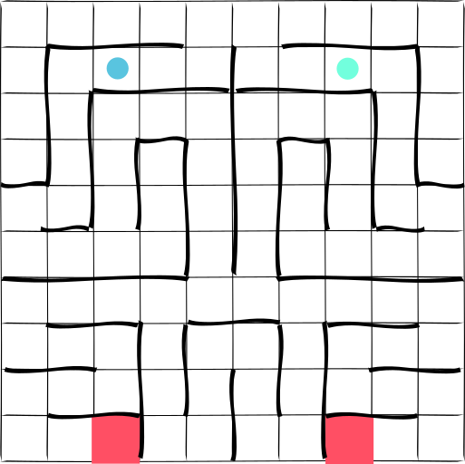

We are working with MDPs $(S, A, \tau, r)$, therefore we have a state space, $S$, an action space, $A$, a transition function $P: S\times A \times S \to [0, 1]$ and a reward function $r: S\times A \to \mathbb R$.

## Near optimal abstraction

Following from [Near Optimal Behavior via Approximate State Abstraction](https://arxiv.org/abs/1701.04113), I am interested in using their framework to reason about which policies are representable within an abstracted MDP. We care about showing that an abstraction with certain properties can approximately represent the optimal solution to the original problem.

An abstract MDP is defined as;

<!-- (Must be smaller / lower complexity than the original) -->

Given an abstraction of the form above, we can ask how well this abstraction can represent the optimal solution.

$$
\forall_{s\in S_G, a\in A_G} \mid Q_G^{\pi^* }(s, a) - Q_G^{\pi_{GA}^* }(s, a) \mid \le 2 \epsilon \eta_f
$$

***

We can impose properties on an abstraction using something like the following;

$$
\begin{align}
\phi (\cdot_a) = \phi(\cdot_b) &\implies \forall_{\cdot_a, \cdot_b \in D} \mid f(\cdot_a) - f(\cdot_b)\mid \le \epsilon\\
\forall_{\cdot_a, \cdot_b \in D} \mid f(\cdot_a) - f(\cdot_b)\mid \le \epsilon &\implies \phi (\cdot_a) = \phi(\cdot_b)\\
\end{align}
$$

<!-- What does the above say? _We want our abstraction to contain approximate symmetries $\forall x \mid f(x) - f(T(x)) \mid \approx 0$_. -->

(where $\eta_f$ is some bound to be derived)

- __Q:__ How should we construct our abstraction?
- __Q:__ What properties should it have to achieve 'good' performance?

Using the above method of imposing properties on an abstraction, what should we pick as $f$?

1. The value function: $\forall_{\cdot_a, \cdot_b \in D} \mid Q(\cdot_a) - Q(\cdot_b)\mid \le \epsilon$ is approximately the same.
1. The policy function: $\forall_{\cdot_a, \cdot_b \in D} \mid \pi(\cdot_a) - \pi(\cdot_b) \mid \le \epsilon$ is approximately the same.
1. The policy trajectory: $\forall_{\cdot_a, \cdot_b \in D} \mid \pi(\cdot_a) - \pi(\cdot_b) \mid \le \epsilon$ is approximately the same.
1. The transition function: $\forall_{\cdot_a, \cdot_b \in D} \mid \tau(\cdot_a) - \tau(\cdot_b)\mid \le \epsilon$ is approximately the same.
1. The transition trajectory: $\forall_{\cdot_a, \cdot_b \in D} \mid \sum_{t=0}^T\parallel \tau(\cdot_{a_t}) - \tau(\cdot_{b_t})\parallel_1\mid \le \epsilon$ is approximately the same.
1. The reward function: $\forall_{\cdot_a, \cdot_b \in D} \mid r(\cdot_a) - r(\cdot_b) \mid \le \epsilon$ is approximately the same.
1. The reward trajectory: $\forall_{\cdot_a, \cdot_b \in D} \mid \sum_{t=0}^T \parallel r(\cdot_{a_t}) - r(\cdot_{b_t})\parallel_1 \mid \le \epsilon$ is approximately the same.
1. Some  combination of 1-7

(1. seems rather nonsensical. why?)

<!-- Note: two states having similar $f$ are not guaranteed to have similar abstraction! -->

__Q:__ Which is best?

> __Claim 1:__ 1.(the value fn) will yield the most compression, while performing well. But, it is a task specific representation, thus it will not transfer / generalise well.

#### Extension to other types of abstraction

We constructed the state abstraction by altering what the policy and value function were allowed to see. Rather than observing the original state space, we gave them access to an abstracted state space.

There are other ways to alter what the policy and value function sees.

$$
\begin{align}
\phi: S \to X&: \quad \pi(s) \to \pi(\phi(s)) \quad Q(s, a) \to Q(\phi(s), a) \tag{State abstraction} \\
\psi: A\to Y&: \quad \pi(s) \to \psi^{-1}(\pi(s)) \quad Q(s, a) \to Q(s, \psi(a)) \tag{Action abstraction} \\
\phi, \psi&: \quad \pi(s) \to \psi^{-1}(\pi(\phi(s))) \quad Q(s, a) \to Q(\phi(s), \psi(a)) \tag{State and action abstraction} \\
\varphi: S \times A \to Z&: \quad \pi(s)\to \mathop{\text{argmax}}_a V(\varphi(s, a)) \quad\quad Q(s, a) \to V(\varphi(s, a)) \tag{State-action abstraction} \\
\end{align}
$$

> __Claim 2:__ The state-action abstraction is the most powerful because it allows the compression of the most symmetries. (want to prove!)

State abstraction groups together states that are similar.
For example, sprinting 100m is equivalent regardless of which track lane you are in.

Action abstraction groups together actions that are similar.
For example, X and Y both yeild the state change in state,
> Approximation perspective: we have a set of options and we want to use them to approximate the optimal policy. A good set of options can efficiently achieve an accurate approximation.

### Motivating example for state and action abstraction: ???

Might want to transfer. But some envs share state space, some share action space. Want to

- Might be teleported to a new environment? (new state space, same action space)
- Might have to drive a new vehicle (same state space, new action space)

### Motivating example for state-action abstraction: Symmetric maze
_(Some intuition behind claim 2.)_

Imagine you are in a mirror symmetric maze. It should not matter to you which side of mirror you are on.

{ width=250px }

This reduces the state-action space by half! $\frac{1}{2}\mid S \mid \times \mid A \mid$. Note: just using state abstraction it is not possible to achieve this reduction. Mirrored states are not equivalent as the actions are inverted.

<!-- ## Generalised symmetries

What about other types of symmetry, other than mirror?

- $\exists f\in X: \forall_{s, a} r(s, a) = r(f(s), a)$. Where $X=GL_N \lor S_N \lor \dots$
 -->

While other learners can still solve this problem. They miss out on efficiency gains by abstracting first.

### Completeness

(_want to show that the way we build our repesentation is capable of capturing all symmetries_)

...

### Notes

Struggling with the direction of implication, $\phi (s_1) = \phi(s_2) \implies \forall_a \mid Q(s_1, a) - Q(s_2, a)\mid \le \epsilon$, what about $\phi (s_1) = \phi(s_2) \impliedby \forall_a \mid Q(s_1, a) - Q(s_2, a)\mid \le \epsilon$?

But can we guarantee that these abstractions do not make it harder to find the optimal policy? Is that even possible?

So this is about messing with what information the value function has. Given more information about the future, we should expect the acuracy (or speed of learning) of the estimate to go up!?

Want a general way (a function) to take an abstraction of an MDP (defined by certain propreties) and return the difference between its optimal policy and the true optimal policy.

Want automated computational complexity to solve this!

### Disentangled action abstractions

(what can we prove about this!?)
How does this related to finding symmetries and state-actions!?
