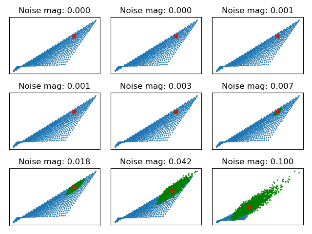

## Intro

In principle, Dynamic programming can be used to solve any / all MDPs. So why isn't it used in practice? The computational cost of using DP to find a solution doesn't scale well with increasingly complex MDPs.

<!-- Insert paragraph describing DP's computational complexity-->

For example;
...
the curse of dimensionality, and stochasticity.

<!-- Want to demonstrate the problem being solved -->

A strategy for efficiently solving MDPs is to transform it into an easier problem and solve that problem. But, which types of MDP are easily solved (and why)? And how can we map our problem into these easily solved instansiations?

This strategy might look like ...
It is also known by many names; abstraction, representation learning, factoring ...
Ultimately, we want to find an abstraction that makes our problem easier to solve.

Which types of (reinforcement learning) problem are easily solved?

- Discrete state space and linear transition fn?
- We know how to solve linear systems of equations with $O()$.
- And we know how to use these solutions to calculate the optimal, policy: generalised policy iteration.

Note that it will not always be possible to find an efficient solution to an MDP.
Are some MDPs just fundammentally harder to solve than others?
Could mention no free lunch.

Which types of problem are easy to solve?

- Tabular MDPs for small enough size ($n\le 200,000$ states) can be analytically solved.
- Linear systems can be solved with computational complexity $\mathcal O(n^3)$.

Which types of MDP are hard to solve?
- The size of the state space, the size of the action space, the topology of the environment, the distribution of rewards.

### Related work

Many thers have tried to find algorithm with better a computational complexity that scales better with MDP compplexity.
For example; X, Y, Z.

What is the lower bound? How close are they to it? Work still to be done!

## A tabular representation

Learn a tabular MDP representation of the RL problem.

Why would we want to do this?
- Policy evaluation is expensive in the RL setting. The policy must be simulated over all possible states-action pairs. And scales poorly with variance. (how poorly?)
- ?

Just quickly, what does a tabular MDP look like?
- discrete states and actions
- $r$ and $P$ are simply look up functions, indexed by the current state-action.

$$
\begin{align}
V &= r_{\pi} + \gamma P_{\pi} V \tag{bellman eqn}\\
V - \gamma P_{\pi} V &= r_{\pi}\\
(I-\gamma P_{\pi})V &= r_{\pi}\\
V &= (I-\gamma P_{\pi})^{-1}r_{\pi}\\
\end{align}
$$

(finding the optimal policy is still a non-linear problem. how / why is it non-linear?!)

### Learning the (tabular) abstraction

Most recent advances in ML have been by finding clever ways to extend supervised learning techniques to unsupervised learning. Similarly, we can use supervised learning techniques, batch training, cross entropy, ... to train reward and transition approximations.

We are provided with examples $(s_t, a_t, r_t, s_{t+1}, a_{t+1})$. We can use these to...

$$
\begin{align}
\textbf  r \in \mathbb R^{n \times m}, &\; \textbf P \in [0,1]^{n \times m \times n} \\
L_{r} &= \text{min} \parallel r_t - \textbf r[\phi(s_t), a_t] \parallel^2_2 \tag{mean squared error}\\
L_{P} &= \mathop{\text{max}}_{\theta} \textbf P[\phi(s_{t+1}),\phi(s_t), a_t]\tag{max likelihood}\\
\end{align}
$$

### Policy iteration

#### Evaluating the learned abstraction

But what about the error in our approximation?
Error in the reward doesnt seem like such a big deal? (why?!?)

- Is the approximation error, $E$ likely to be biased in any way? Certain states or actions having more error than others? Or can we just model it as noise?
- Are some of the elements likely to be correlated? Or can we sample the noise IID?  
- If so, what sort of noise is $E$. Want uniform noise on a simplex. One draw for each state.

$$
\begin{align}
E &\sim \mathcal N, \parallel E \parallel_{\infty} < \delta \\
\hat P &= P + E \\
\hat V &= (I-\gamma \hat P \pi)^{-1}r \pi \\
\epsilon &= \parallel V - \hat V \parallel_{\infty}\\
&= \parallel (I-\gamma P \pi)^{-1}r \pi -  (I-\gamma (P + E) \pi)^{-1}r \pi \parallel_{\infty} \\
&= \parallel\Big((I-\gamma P \pi)^{-1} -  (I-\gamma P\pi + \gamma E\pi)^{-1} \Big)r \pi \parallel_{\infty} \\
\end{align}
$$

Want to find $X$ such that $(I-\gamma P\pi)^{-1} - (I-\gamma P\pi + \gamma\Delta\pi)^{-1} = X$. or an upper bound on $X$?

Hmph.
- Why are we inverting.
- What does the inverse do? How does it deal with small pertubations?
- https://en.wikipedia.org/wiki/Woodbury_matrix_identity. Can be derived by solving $(A + UCV)X = I$. Nice!

$$
\begin{align}
X &= (I-\gamma P\pi)^{-1}U(C^{-1}+ V(I-\gamma P\pi)^{-1}U)V(I-\gamma P\pi)^{-1} \\
\epsilon &= X r \pi \\
\epsilon[i] &\le \parallel Xr\pi \parallel_{\infty}
\end{align}
$$

What is the goal here? To write the error in terms of properties of $P, r, \pi$. The condition of $P$, the ...?

TODO. Could visualise this using 2-state 2-action MDP.

__WANT__ How does the variance in the estimated value scale with the variance in the noise?

$$
\begin{align}
V(x) &= (I-\gamma (P + x) \pi)^{-1}r \pi \\
\epsilon(n) &= \parallel V(\textbf 0) - V(n) \parallel_{\infty} \\
\text{var}(\epsilon) &= \mathop{E}_{n \sim N(0, \sigma)}[\epsilon(n)^2] - \mathop{E}_{n \sim N(0, \sigma)}[\epsilon(n)]^2 \\
&= \mathop{E}_{n \sim N(0, \sigma)}[(\parallel V(\textbf 0) -  V(n) \parallel_{\infty})^2] - \mathop{E}_{n \sim N(0, \sigma)}[(\parallel V(\textbf 0) -  V(n) \parallel_{\infty})]^2\\
\end{align}
$$

- To calculate this we will need to bound the det of P?!
- Also, we cant add noise like this. P needs to be a row stochastic matix...

#### Dynamics

!?

### A linear representation

The bellman equation is a non-linear optimisation problem.
Is there a way to turn this into a linear problem? What do we need to sacrifice to do so?

$$
v(s) = \mathop{\text{max}}_a \Big[r(s, a) + \gamma \mathop{\mathbb E}_{s' \sim P(\cdot | s, a)} v(s') \Big]\\
$$

^^^ What makes it non-linear?!?

#### Linear markov decision problems (LMDPs)

How can we remove the sources of non-linearity from the bellman equation? The answer is a couple of 'tricks';

- rather than optimising in the space of actions, optimise in the space of possible transition functions.
- set the policy to be
- ?

Let's unpack these tricks and see how they can allow us to convert an MDP into a linear problem. And what the conversion costs.

$$
v(s) = \mathop{\text{max}}_u \Big[r(s) + \gamma \mathop{\mathbb E}_{s' \sim u(\cdot | s)} v(s') \Big] \\
\text{s.t.}  \;\; u(\cdot | s) \;\;\; ??? \\
$$

Could derive using Lagrangian multiplier?

$$
l(s, a) = q(s) + KL(u(\cdot | s) \parallel p(\cdot | s)) \\
v(x) = q(s) + \mathop{\text{max}}_a \Big[ KL(u(\cdot | s) \parallel p(\cdot | s)) +  \gamma \mathop{\mathbb E}_{x' \sim P(\cdot | x, a)} v(x') \Big]\\
$$

## Linear programming

(doesnt need to be tabular!? what does this require?!)

So far, "solvable representations" has meant having an efficient method to solve a representation of an MDP. Easy (optimisation) problems to solve;
matrix inversion, policy iteration, linear programming...

## A convex representation

MAYBE???? Need more time...
https://bodono.github.io/thesis/bod_thesis.pdf !!!

***

Ok great. How does computational complexity relate to sample complexity?
We are considering different problems.
- Sample complexity in MBRL comes from learning the transition and reward function. Computational complexity is considered (here) for the optimal control problem (only?).
